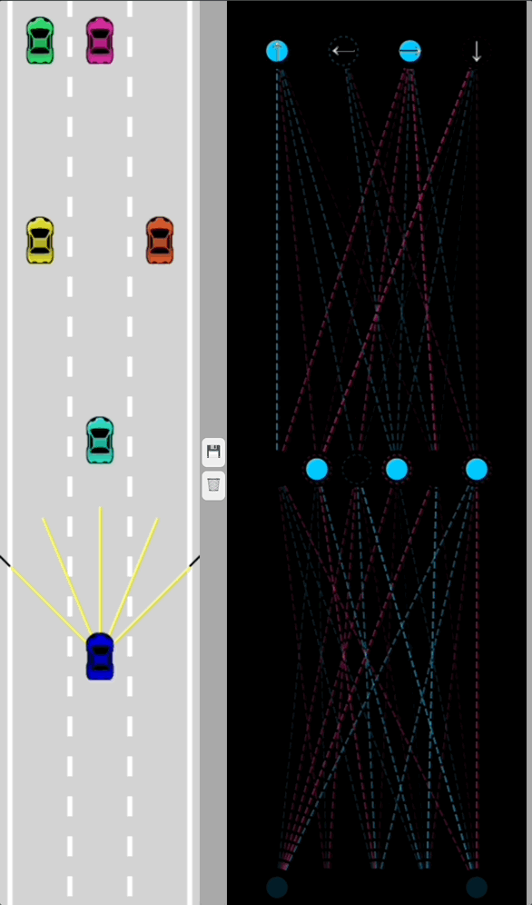
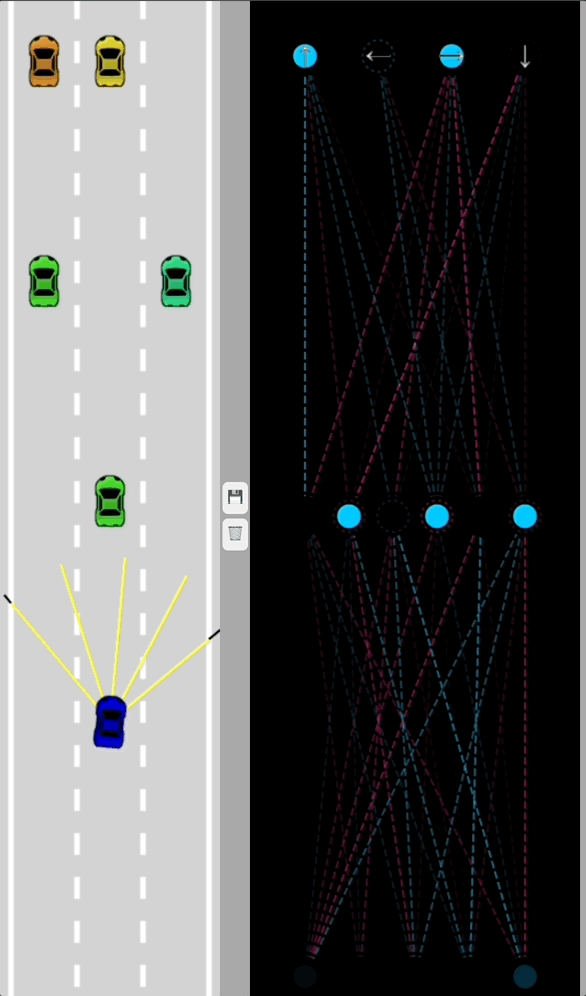

# Self-Driving Car Application
This application uses machine learning and artificial neural network to simulate self-driving mechanics in the real world.
- Build with `VanillaJS` - no libraries.

## Features
- Self-Driving Mechanic
- Sensor & Collission Detection
- Simulated real world traffic
- Neural Network Visualization
- Saving / Discarding test-run results.

## Network Architecture & Controls
Initially, the car is controlled by `ArrowKeys`. It later is controlled by `neural network` in form of movement array.

- 1st Layer will be Input Layer (send signals forward many times).
- 2nd Layer (hidden layer) acts as the 'brain'.
- 3rd Layer (output layer) is the 'reaction/behavior'.

## Demo

    

        

            
Manual Control via Arrow Keys

            
        

        

            
Running 500N test for best car & Save to Local Storage

            
        

        

            
Final result with best run

            
        

    

## Progress Checklist
| Feature                   | Status |
|---------------------------|--------|
| Build collision detection |   ✅   |
| Add simulated traffic     |   ✅   |
| Apply neural network      |   ✅   |
| Add parallelization       |   ✅   |
| Add genetic algorithm     |   ✅   |

Stretch Features:
- Switch between manual and AI.
- Manually set traffic cars (or infinitely with time constraint).
- Lane driving enforcement (can't drive between lanes).
- Apply neural network to some traffic cars, enabling them to change lanes like in real world.
- Automatically save the best test (maybe using a server to store best car not Local Storage).
- Turn into an interacting game?

## Lesson & Impact
- Hands-on experience implementing a basic neural network from scratch.
- Used geometric calculations to simulate real world sensor systems.
- Gained insights into how neural networks make decisions by visualizing data flow and system reactions.

➡ Deeper understanding of autonomous vehicles & appreciation for self-driving mechanism.

➡ Transformed neural network logic into real-time visual feedback.

➡ Challenge my technical skills physically and mentally with VanillaJS without any modern libraries like React & Next.

